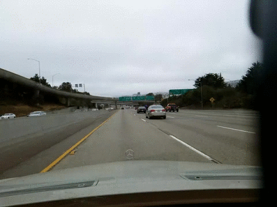
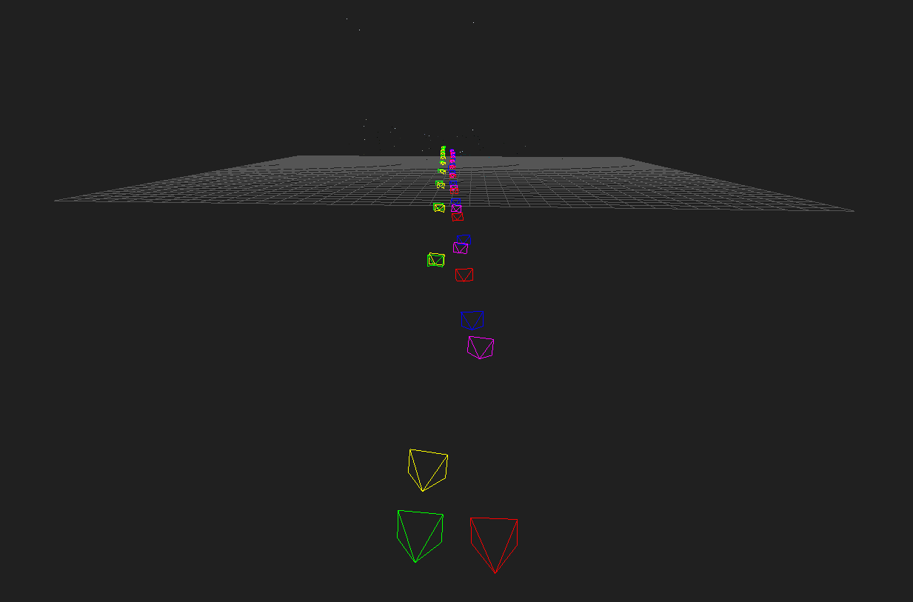
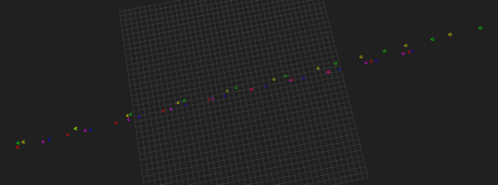

## Structure from motion (SFM) for highway driving scenes

We are given five videos of driving the same stretch of highway. For example,
one of the videos looks like this:

The goal is to estimate the relative 3D pose of the camera in each frame of
each video (up to scale). This repo shows a way to solve this problem using a
custom SFM pipeline built on top of
[OpenSFM](https://github.com/mapillary/OpenSfM).

The screenshots below show what the final map looks like. The cameras are
color-coded to identify each video: red for `0_*.jpg`, green for `1_*.jpg`,
blue for `2_*.jpg`, yellow for `3_*.jpg`, and magenta for `4_*.jpg`.  It can be
seen clearly that the videos were taken from two different lanes.

The following files are provided:

    dataset/        - contains the images from each video
    sample_output/  - example output reconstruction
    viewer/         - the viewer from opensfm, tweaked to color-code cameras
    README.md       - you're reading it
    clean.sh        - cleans a dataset
    run_all.py      - runs the entire reconstruction pipeline on a dataset

The code uses building blocks from OpenSFM, and has the [same
dependencies](https://github.com/mapillary/OpenSfM#dependencies).

To build the reconstruction, run:

    ./clean.sh dataset
    PYTHONPATH=$OPENSFM_INSTALL_DIR ./run_all.py dataset

where `$OPENSFM_INSTALL_DIR` is wherever you installed OpenSFM. Note that
because of RANSAC, you may get slightly different results each time you run the
above. Two or three runs should be enough to get a reconstruction as good as
the one provided in `sample_output/reconstruction.json` and shown in the
screenshots above.

To visualize the reconstruction, run:

    python -m SimpleHTTPServer

then point your browser to
[http://localhost:8000/viewer/reconstruction.html#file=/dataset/reconstruction.json](http://localhost:8000/viewer/reconstruction.html#file=/dataset/reconstruction.json).
Hit refresh to read the latest reconstruction. If you just want to visualize
the reconstruction provided in `sample_output`, go to 
[http://localhost:8000/viewer/reconstruction.html#file=/sample_output/reconstruction.json](http://localhost:8000/viewer/reconstruction.html#file=/sample_output/reconstruction.json)
instead.

## How it works

First, I wanted to see how far I could get by just using OpenSFM out of the
box. It turned out that out-of-the-box OpenSFM produced a pretty bad
reconstruction, so I dug in to figure out how to improve it.

#### A sketch of the OpenSFM reconstruction pipeline

Here is a sketch of OpenSFM's reconstruction pipeline, based on a quick
reading of their code. I will discuss below how my pipeline differs from
theirs.

1. Extract camera params and GPS coordinates from EXIF data -- not relevant
   since our images lack EXIF data.

1. Extract features from each image.

1. For each image, find candidate images to match with, based on GPS data -- in
   our case, since there is no GPS data, all image pairs are considered.

    1. Optionally use a cheap preemptive matching to quickly discard the pair
       of images if they don't match very well.
    1. Compute symmetric matches. These are feature pairs `(f1, f2)` in
       `image1` and `image2` respectively, where `f2` is the best match for
       `f1`, and vice versa, and the second-best match in each image is much
       worse.
    1. Compute robust matches by finding a fundamental matrix that maps points
       from one image to the other, computing reprojection error w.r.t. this
       fundamental matrix, and discarding outliers.

1. Create tracks graph. A track is a feature that has been matched in 2 or more
   images. Each track has a unique id. (In the reconstruction, every track will
   become a point in 3D, triangulated from the images in which it appears.)

   The tracks graph is a bipartite graph with images on the left side and track
   ids on the right side. An edge between `image_i` and `track_j` indicates
   that the given track occurs in the given image. The edge stores the image
   coordinates and feature id of that correspondence.

   Note that symmetric feature matching is crucial for getting valid tracks. If
   `f1` in `image1` is matched to `f2` in `image2`, but `f2` in `image2` is
   matched to `f3 != f1` in `image1`, we would have an invalid track that goes
   through two different features in `image1`.

1. Bootstrap the 3D reconstruction.

    1. Pick a pair of "shots" (a shot is an image taken from a given pose)
       `(image1, image2)` to bootstrap the reconstruction with. They do this by
       computing a homography between every pair of candidate images and
       choosing the pair with minimal reprojection error.
    1. Set the pose of the first camera to `(R1=I, t1=0)`, and compute the
       relative pose of the second camera `(R2, t2)`. Note that `t` is
       ambiguous up to scale, but that will be taken care of in the bundle
       adjustment step below.
    1. Triangulate all common tracks between `image1` and `image2`, adding them
       as 3D points to the reconstruction and removing any outliers.
    1. Bundle-adjust the pose of the second camera to minimize reprojection
       error.

1. Iteratively "grow" the 3D reconstruction.

    1. Pick the next shot `image3` to add to the reconstruction, preferring
       images that have a lot of tracks that are already present in the
       reconstruction built so far.
    1. Solve for the absolute pose of the new shot, by using its
       correspondences with 3D points that are already present in the
       reconstruction. This is call resectioning.
    1. Add the new shot to the scene and bundle-adjust it by itself. (This
       optimizes the pose of the new shot, holding everything else constant.)
    1. Triangulate any new points that occur in `image3` and some image already
       in the reconstruction.
    1. Bundle-adjust the whole reconstruction. (This optimizes the pose of all
       shots and the 3D location of all points, jointly.)
    1. Pick the next `image4` and repeat.

1. If the above process did not use all images (e.g. because there were not
   enough common tracks), bootstrap a second reconstruction, and so on.

#### Tweaks for our specific problem

There are a few things I noticed right away that made the built-in OpenSFM
pipeline less than ideal for our problem:

- Without EXIF tags, they assume every shot was taken with the same camera,
  with unknown focal length and distortion parameters. In our case, each video
  was taken with a potentially different camera.

- Without GPS, they compute feature matches between all pairs of images. This
  is slow, and can lead to incorrect tracks if e.g. a feature in `0_1.jpg` is
  matched to a feature in `0_9.jpg`, since the two frames are too far apart
  to have any reliable features in common.

- They prune features very aggressively (symmetric matches based on second-best
  rule, then robust matches based on computing a fundamental matrix). This
  works fine when you have lots of images of the same scene, but in our case it
  leads to extreme feature sparsity.

- The homography-based method to pick the two images to start the
  reconstruction with might work OK if the images are all of the same
  approximately planar scene, like the face of a building. But our images are
  not even of the same "scene", since each frame moves forward, and anyway, the
  scene is far from being planar.

- It's tough to triangulate points when the second camera sits directly in
  front of the first camera, since the rays from the camera centers to the
  3D point are nearly parallel. Lowering the `triangulation_min_ray_angle`
  parameter helps avoid discarding too many of these points.

- OpenSFM assumes a static scene, but in our case there are other cars moving
  on the freeway. A crude workaround is to simply discard any features
  extracted from the road part of each image. This can be achieved using masks
  (regions of the image from which to discard any extracted features).

Setting up masks and tuning `triangulation_min_ray_angle` was enough to
reconstruct the `0_*.jpg` video using the OpenSFM pipeline. But adding more
images from the other videos still produced a bad reconstruction. So I decided
to write my own pipeline using building blocks from OpenSFM.

#### Custom reconstruction pipeline

Here is how my pipeline differs from the OpenSFM pipeline:

- Feature extraction:

    - Use masks to avoid bad image areas (road with moving cars, windshield
      dead zones).

- Feature matching:

    - Don't match every image pair. Instead, match each image (e.g. `2_5.jpg`)
      to its previous and next frame in the same video (`2_4.jpg` and
      `2_6.jpg`), and to the corresponding frame in all other videos
      (`0_5.jpg`, `1_5.jpg`, etc). This works well because the videos are more
      or less aligned (i.e. the car is moving at roughly the same speed, and
      the sampling frequency is roughly the same). For a more general approach,
      it would be better to match images and add them to the tracks graph
      dynamically, instead of in a preprocessing step.
    - Use the symmetric matches directly; don't prune them any further with
      their "robust matching" technique.

      Note: Even symmetric matches can be too sparse; e.g. `1_8.jpg` and
      `1_9.jpg` have only 18 symmetric matches. And only a subset of those
      might appear in the reconstruction. I tried several techniques to get
      more matches:

        - Increase `lowes_ratio` to make the second-best pruning rule less
          aggressive.
        - Write my custom matcher `match_custom` to avoid the second-best
          pruning altogether. I left this in the code so you can see how it
          works, but it did not end up improving the results.

      In the end, what worked best was using the original symmetric matches,
      but making sure that several videos were reconstructed together. For
      example, when reconstructing video `1_*.jpg` by itself, `1_8.jpg` and
      `1_9.jpg` have 18 symmetric matches and only 4 of them occur in the
      reconstruction before the `1_9.jpg` shot is added, so getting a good pose
      for `1_9.jpg` is really hard. When reconstructing all videos together,
      `1_8.jpg` and `1_9.jpg` still have only 18 symmetric matches, but 13 of
      them occur in the reconstruction, making the pose estimation much easier.

- Reconstruction:

    - Give each video a separate set of camera parameters, but make all frames
      in the same video share the same parameters. This allows the bundle
      adjustment step to find different focal lengths and distortion parameters
      for the different cameras.

    - Use a custom image pair to start with, and a custom order in which to
      "grow" (add images to) the reconstruction. I tried several approaches
      here (see `get_reconstruction_order`), and settled on a predetermined
      heuristic order. For example, the `0_*.jpg` video is pretty easy to
      reconstruct, so it helps to reconstruct it entirely before adding shots
      from other videos.

    - Avoid the complicated resectioning that OpenSFM does. In the bootstrap
      step, OpenSFM solves a [relative pose
      problem](https://github.com/mapillary/OpenSfM/blob/0343d7950bb584b678f0d8fd8404fa38947879e8/opensfm/reconstruction.py#L249),
      but in the grow step it solves an [absolute pose
      problem](https://github.com/mapillary/OpenSfM/blob/0343d7950bb584b678f0d8fd8404fa38947879e8/opensfm/reconstruction.py#L406).
      I wrote my pipeline to solve a relative pose problem in both cases, thus
      making it more simple, reducing the number of building blocks from OpenGV
      that I need to use, and making the `hint_forward` trick (described below)
      possible. The downside is that each new shot being added to the
      reconstruction needs a reference shot (already in the reconstruction)
      from which to compute its relative pose. This is easy in our case, since
      the frames in each video have a natural ordering.

    - Take advantage of the fact that the camera moves forward from frame `i`
      to frame `i+1`, with very little rotation, and a translation that is
      mostly along the z axis. When computing the pose of successive frames
      from the same video, I pass `hint_forward=True` into my custom
      reconstruction routine. This causes it to retry finding the relative pose
      between the two views (using RANSAC) until it finds a transformation that
      agrees with the z-axis motion described above.

      Note: This is a rather crude approach to get the job done quickly, and
      there are more elegant ways of handling this:

        - Assume an identity rotation between the two views, and solve for
          translation only. OpenGV [supports
          this](https://github.com/laurentkneip/opengv/blob/be7a676f1ffb26072110a5858bf746d1c8eb5d28/include/opengv/sac_problems/relative_pose/TranslationOnlySacProblem.hpp#L62-L68),
          but unfortunately it [does not make this functionality available
          through its Python
          API](https://github.com/laurentkneip/opengv/blob/be7a676f1ffb26072110a5858bf746d1c8eb5d28/python/pyopengv.cpp#L504-L507). Of course, we could always just do it ourselves.

        - Add the appropriate [rotation and translation
          priors](https://github.com/mapillary/OpenSfM/blob/0343d7950bb584b678f0d8fd8404fa38947879e8/opensfm/src/bundle.h#L611-L639)
          to the bundle adjustment problem, so that it appropriately penalizes
          transformations that disagree with `hint_forward`.

This is enough to solve the given problem, but there are lots of ways to make
the pipeline more robust. I described some of them above, and left some as
FIXMEs in the code.
